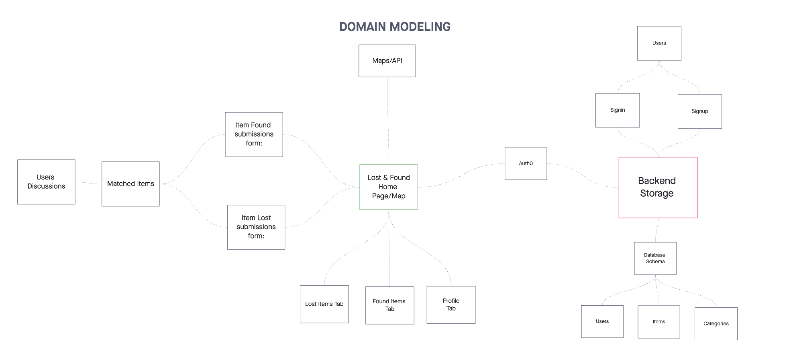
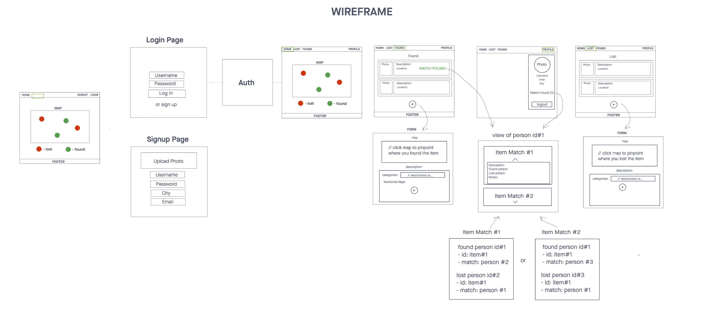

# LostHub Server

**Authors**:

- [Adnan Mohamud](https://github.com/adnanm123)
- [Chester Lee Coloma](https://github.com/cleecoloma)
- [David Danilchik](https://github.com/Arkuris)
- [Ekaterina Khoroshilova](https://github.com/KatKho)

## Overview

The Lost & Found app streamlines reporting and finding lost items, offering a user-friendly platform to report and retrieve belongings efficiently. It addresses the inconvenience of traditional lost and found systems by providing a centralized digital solution.

## Getting Started

To get the LostHub frontend up and running on your machine, follow these instructions:

1. **Clone the Repository**: `git clone https://github.com/lost-hub-app/lost-hub-frontend.git`
2. **Navigate to the Project Directory**: `cd lost-hub-frontend`
3. **Install Dependencies**: Run `npm install` to install the required dependencies.
4. **Configure Environment Variables**:
   - Rename the `.env.sample` file to `.env`.
   - Update SERVER_URL in the `.env` file with Server URL or if running on local use `http://localhost:3001`.
   - Update VITE_GOOGLE_MAPS_API_KEY in the `.env` file with Google Maps API Key.
   - Update VITE_AUTH_DOMAIN in the `.env` file with a Auth Domain from Auth0.
   - Update VITE_AUTH_CLIENT_ID in the `.env` file with Auth Client ID from Auth0.
6. **Launch the Express Server**: Run `npm run dev`.
7. **Access the Application**: Open your web browser and go to the provided URL (typically `http://localhost:5137`).

## Domain Modeling

## Project Management Board

[Trello](https://trello.com/b/K503Pxff/losthub)

## Wireframe

## Architecture

LostHub is structured using the MERN stack:

- **Front-end**: Create with React and uses Axios, which handles HTTP requests and communicates with the Lost Hub Server.
- **API**: Utilizes Google Maps API to display lost and found items.

## License

LostHub is licensed under the [MIT License](./LICENSE). Feel free to use, modify, and distribute the code as per the terms of the license.

## Support

For any issues or questions, please [open a new issue](https://github.com/lost-hub-app/lost-hub-frontend/issues) on GitHub. We appreciate your feedback!

## Acknowledgments

Special thanks to:

- Jacob Knaack
- ChatGPT
- Bard
- Slidesgo