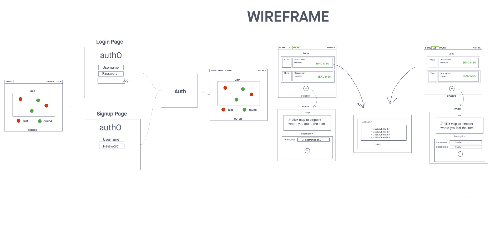
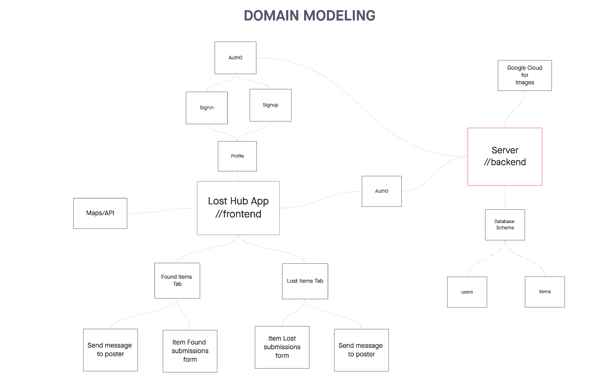

# Team LostHub

Adnan Mohamud, Ekaterina Khoroshilova, David Danilchik, Chester Lee Coloma

## LostHub

Summary of Idea:

- The Lost & Found app streamlines reporting and finding lost items, offering a user-friendly platform to report and retrieve belongings efficiently. It addresses the inconvenience of traditional lost and found systems by providing a centralized digital solution.

## Project Management Board

[Trello](https://trello.com/b/K503Pxff/losthub)

## Wireframe

## Domain Modeling

## Database Schema Diagram

